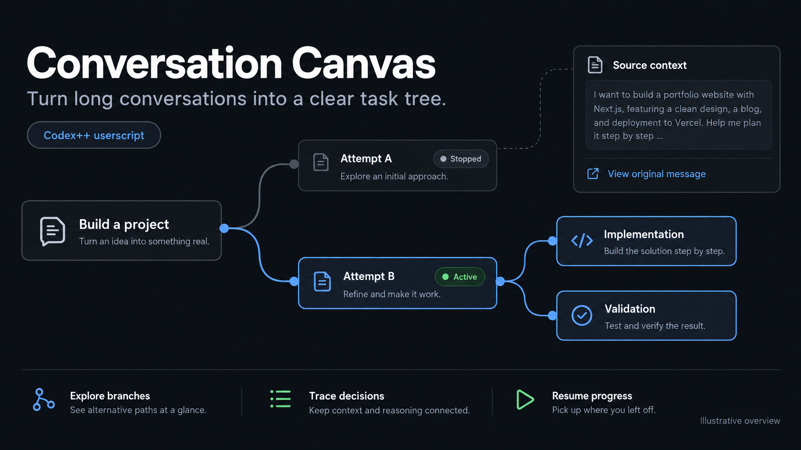

# Conversation Canvas / 对话脉络

Turn long Codex conversations into a task tree you can explore, review and trace back to the original messages.

Current version: **0.6.0** — parallel dialogue summaries (up to 128 requests), whole-conversation tree arrangement, and evidence-grounded review.



*Illustrative feature overview / 功能示意图，非实际界面截图。Independent local app available；独立模式无需 Codex++。*

[Install / 独立安装](docs/standalone.md) · [Features / 功能](#features) · [Compatibility / 兼容性](#architecture-and-compatibility) · [Report a bug / 反馈问题](https://github.com/Songjun113/codex-conversation-canvas/issues)

Originally developed as an optional tool for [CodexPlusPlus](https://github.com/BigPizzaV3/CodexPlusPlus), with upstream integration proposed in [PR #2128](https://github.com/BigPizzaV3/CodexPlusPlus/pull/2128). This repository is the standalone development and distribution home. It preserves the plugin's two original commits (with rewritten hashes because the directory is now the repository root), their authors and dates, and the AGPL-3.0-only license.

## Codex 内按钮与弹窗

推荐桌面安装方式（Windows，已有 Codex++）：

```powershell
.\install-desktop.ps1 -AutoStart
```

安装会备份旧画布脚本、替换为桌面桥接版，并设置当前用户登录时后台启动。现在点击 Codex 右上角分支图标即可打开大幅画布弹窗。也可通过 `npm run desktop` 手动运行后台；默认复用 Codex++ 的本机 9229 调试端口，可用 `CANVAS_DEBUG_PORT` 覆盖。

画布直接渲染在页面中，不使用 iframe、不导入带哈希的 Desktop 内部模块；标准 Chromium 连接只负责入口和请求传输。对话读取、第三方 API 调用及结果保存全部由独立本地服务完成。若标题栏结构改变，按钮降级到右上角；若无法自动识别当前任务，可手动选择本机对话。

这一入口依赖可用的桌面调试连接（通常由 Codex++ 启动器提供），没有修改官方程序文件或关闭 CSP。未来调试机制、官方历史协议或文件格式变化仍可能需要维护，不能承诺对所有未来版本永久兼容。[详细说明](docs/standalone.md)

## Recommended: standalone mode / 推荐独立模式

Version **0.4.0** adds a local application that reads saved conversations through the official CLI app-server, with validated local JSONL history as a fallback. Model requests go directly from the local service to your configured OpenAI-compatible API. The core canvas no longer imports private Codex Desktop modules and does not require Codex++.

```powershell
npm start
```

Open the local URL printed by the program, select a conversation, configure the API using the gear button, then click **整理脉络**. Node.js 22+ is required; there are no npm dependencies. See [安装、存储与兼容范围](docs/standalone.md) for setup, backups and limitations.

Desktop UI updates no longer determine whether the independent canvas can run. Future history-format or protocol changes may still require an adapter update. Remote/cloud histories absent from this machine are not supported. Existing userscript trees remain in their original application storage; automatic migration is not yet available.

The optional [public/canvas.user.js](public/canvas.user.js) retains the Codex++ header integration below, including its version-dependent desktop adapters.

## Features

- Automatic second-pass logic review after organization: improves node wording and parent relationships, preserves evidence, and resumes from saved review pages.
- Prominent primary action button and adaptive response-size handling, including smaller batches and source-preserving long-message splits.

- Conversation-area tree with curved edges, pan, zoom, branch folding and current-node focus.
- User-triggered organization in a background Codex conversation (GPT-5.6 Luna, medium), or through an OpenAI-compatible Chat Completions API.
- Paginated history, complete text segmentation, durable batch checkpoints and incremental updates. Each batch must cover every supplied source fragment before it commits.
- External API streaming progress and up to two automatic retries for temporary failures. Official DeepSeek V4 models default to non-thinking mode, with a provider-default option in settings.
- Local tree storage in a separate data directory for standalone mode, or IndexedDB for the userscript. API keys remain in memory unless the user explicitly chooses plaintext local persistence.

## Build and test

Requires Node.js 22 or newer. No npm dependencies are required.

```powershell
git clone https://github.com/Songjun113/codex-conversation-canvas.git
cd codex-conversation-canvas
npm test
npm run build
```

Generated files are `public/canvas.user.js`, `public/canvas.standalone.js`, and `public/canvas.desktop.user.js`. Builds do not read local conversations or embed annotations. The release is reproducible from this directory alone.

## Install in Codex++

1. Build the script, or use the generated file included in this directory.
2. In Codex++ **用户脚本**, install `public/canvas.user.js` and enable it. If updating an existing installation, replace that script rather than enabling a duplicate.
3. Choose **重新加载用户脚本**, return to a task and open **对话脉络** in its header.
4. Use **整理设置** to choose Codex background organization or enter your API endpoint, model and key. Click **整理脉络** once to process the available history.

Drag the canvas to pan, use the wheel or +/- to zoom, and **适应视图** to fit the tree. New messages remain pending until the next incremental organization. Disabling and reloading the script removes its UI; it does not erase locally saved trees.

The model identifies the tree structure. A saved chain remains a chain; the renderer does not fabricate branches. Source coverage establishes traceability, not the accuracy of every model conclusion.

## Architecture and compatibility

- `standalone/`: local server, official read-only app-server client, history-file adapter and independent browser host.
- [Standalone compatibility and data storage](docs/standalone.md). The Desktop build restrictions below apply only to the optional userscript.

- `model.mjs`, `tree-markup.mjs`, `tree-canvas.mjs`: grounded graph model and view helpers.
- `long-organizer.mjs`: segmentation, selected prior context, atomic batch merging and resume.
- `external-api.mjs`: provider options, streaming decoding, retries and cancellation.
- `native-runtime.mjs`: discovers loaded desktop assets and binds reviewed, version-specific exports; failed loads can retry.
- `native-history.mjs`, `src/native-sidechat.js`, `src/native-api.js`: desktop history, background task and HTTP adapters.
- `src/canvas-panel.js`: native header entry, canvas UI and settings; `src/canvas-store.js`: local persistence.
- `build-userscript.mjs`: dependency-free userscript bundler.

The desktop adapters use private exports and explicitly reviewed build mappings. **Windows Codex Desktop 26.901.6511 with Codex++ 1.2.56** retains the original history, HTTP and background-organization adapters. Version **0.3.4** includes history and HTTP bindings for **Desktop 26.908.9136.0** and adds bindings for **26.915.3509.0** and **26.924.1866.0**, fixing attempts to import a removed asset after an application update. Background organization on those newer builds is not yet supported: select an external API in settings. Reading history no longer requires the background-submission interface. Unknown builds report an unsupported-version message rather than guessing export names. The new bindings have static bundle inspection and automated fixture coverage; a live desktop end-to-end check remains pending. A future built-in integration should expose stable host APIs for paginated history, background organization and message navigation.

The script covers user/assistant text, not tool output or image semantics. Sending a batch to an external API shares that text with the configured provider. An interrupted request may still incur provider charges; retries can be billed again. Completed batches are retained. No service keys, session files, local diagnostics, extracted desktop bundles or personal annotations are included here.

## Synthetic UI test

```powershell
npm run build
npm run dev
```

Open `http://127.0.0.1:47834/host?thread=11111111-1111-1111-1111-111111111111&tree&canvas` for the branching layout fixture. For API recovery, omit `&canvas` and add `&apiretry`; select external API, enter a test HTTPS endpoint/model and the synthetic key `fixture-key`. The mock returns 503 once, then streams a successful reply. This server binds only to loopback and mocks the native bridge. It never calls the configured provider.

## Validation

72 distributable Node tests cover runtime discovery, versioned bindings, failed-load retry, independent history access, history paging, long-message coverage, persistence, invalid sources, task isolation, paused requests, SSE boundaries, retries and 10,000-node tree layout. The original development workspace also has a legacy local-server test, which is intentionally excluded with that obsolete server.

Synthetic browser checks cover strict CSP (`frame-src 'none'`, `connect-src 'none'`), zoom/pan, folding, source navigation and one-click recovery after 503. Earlier desktop testing confirmed background organization and source navigation on the target version. The 0.3.1 API speed change has not been benchmarked against a live DeepSeek request. No claim is made here that the upstream Rust workspace tests or clippy have run for this addition.

## License

AGPL-3.0-only, consistent with CodexPlusPlus. See `license` and the upstream contribution policy.

### 并行概括（0.5.0）

外接 API 默认先用 4 路并发提取每轮对话的结构化事实，再一次读取全部概括编排完整任务树，最后复盘逻辑与文字。设置里可选择 1、2、4、8、16、32、64、128 路；限流或超时后自动降低本次并发。每份概括立即保存，继续整理时只补未完成部分。任务树保留原始消息与字符位置，概括完成顺序不影响画布逻辑。

请求数量和费用可能增加；实际提速取决于服务商的并发与额度限制。原生 Codex 通道仍使用串行整理。

### 全局编排（0.6.0）

外接 API 默认一次输入全部概括生成完整画布。概括输入超过约 10 万字符时，先按组压缩事实，再全局编排；来源覆盖逐组校验，不静默截断历史。完整输出超限时先生成全树骨架，再复盘补全描述。新增消息只补做概括，但新旧概括一起重新编排，便于修正跨轮关系。完成前继续显示旧画布。字符预算是本地保守阈值，不代表服务商的 token 上限。
